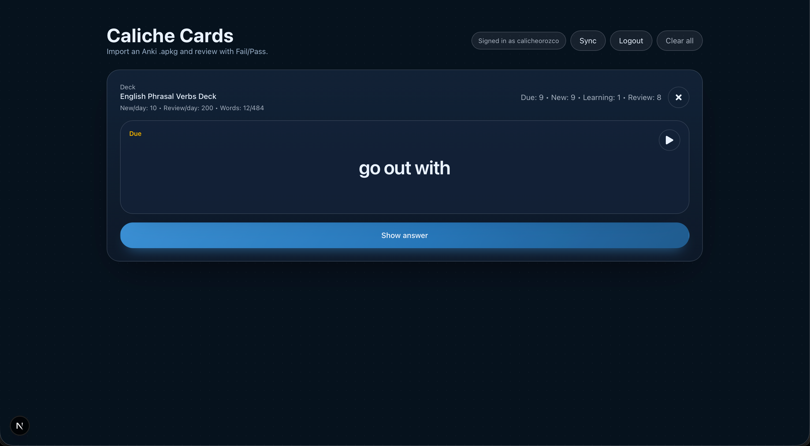
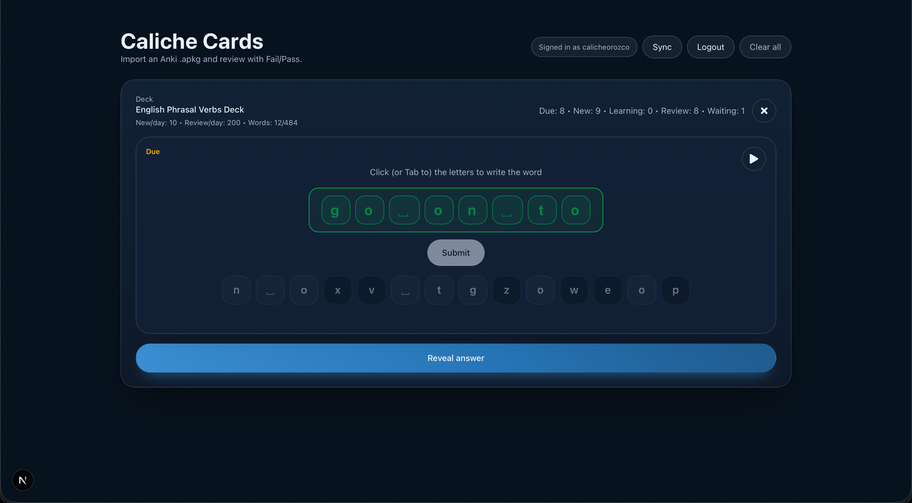
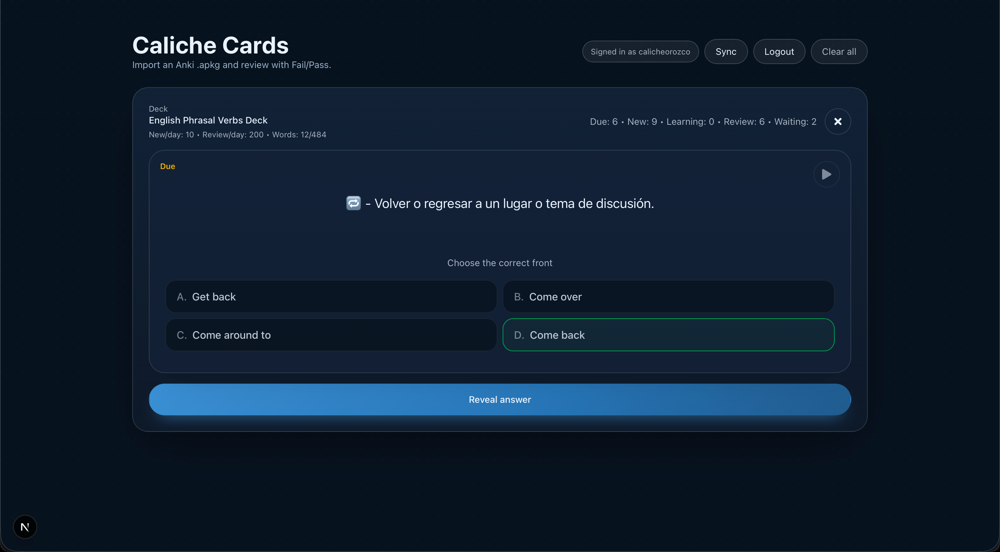
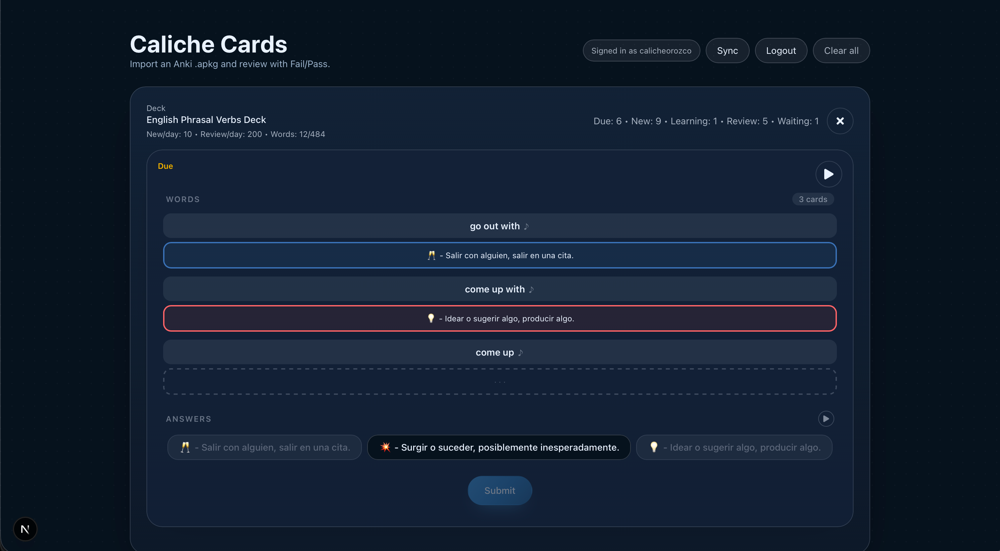

# Caliche Cards

An offline-first, Anki-compatible flashcard PWA built with Next.js. installable on any device, works without internet, and keeps the same simple review flow everywhere.


---

## Screenshots

| Normal | Card Reverse | Write |
|---|---|---|
|  |  |  |

| Multiple Choice | Reverse | Match |
|---|---|---|
|  |  |  |

---

## Why I built this

I love Anki's spaced-repetition method, but my workflow had two real friction points.

**On iOS**, I couldn't use Anki the way I wanted without depending on a specific paid app or being locked to one device. **On Anki Web**, I couldn't use the add-on I rely on that simplifies review to just two buttons `Fail` and `Pass` because that add-on only runs on the desktop client. My study flow was never consistent across devices.

So I decided to build my own and once I started, I didn't stop at just replicating what Anki does. I kept adding the things I actually wished existed:

- **Multiple question types**: not just front/back flashcards, but write-the-answer, multiple choice (with smarter distractors pulled from cards you've already reviewed), reverse mode, and a match game where you connect several due cards at once and all of them get scored in a single round.
- **Audio-aware reviews**: cards with sound files play automatically at the right moment depending on the question type, and every mode has explicit play buttons so you're never hunting for audio.
- **Offline-first on every device**: installable as a PWA, full service worker cache, works on iOS Safari without any app store.
- **Cloud sync with deduplication**: your progress and decks follow you across devices, and if two users upload the same `.apkg`, it's stored only once.
- **Per-deck configuration**: daily limits, which question types to enable, write-mode language, and more, all stored locally so they survive offline.

The goal was a study tool that feels native on a phone, works on a plane, and never forces you into a different workflow depending on which device you're on.

---

## Features

### Question types

| Type | Description |
|---|---|
| **Normal** | Classic front → reveal back. You decide Fail or Pass. |
| **Write** | Type the answer letter by letter using an on-screen keyboard. Auto-evaluated on Submit. |
| **Multiple Choice** | Pick from 4 options. 1–2 distractors are pulled from cards you've already reviewed to make it harder. Requires a Submit tap so you can reconsider. |
| **Reverse** | The back becomes the prompt and you pick the correct front. Requires a Submit tap so you can reconsider. Distractors are prioritized to share words with the correct answer. |
| **Match** | 2–10 due cards shown at once, match each word to its answer. All cards are scored individually on Submit. Includes a play button in the Answers section so you can hear each word without scrolling. |

Each style is weighted equally in the random picker, so no single type dominates your session.

### Scheduler

Uses a spaced-repetition algorithm (SM-2 inspired) with configurable steps, ease factor, graduating intervals, and lapse handling, same logic as Anki.

### Offline-first PWA

- Installable on iOS (Add to Home Screen) and Android/desktop
- Service worker caches the app shell and assets, works with no internet
- Media (audio, images) stored in IndexedDB

### Cloud sync

- Sync decks and progress across devices via a MongoDB backend
- Cross-user deck deduplication (SHA-256): if two users upload the same `.apkg`, only one copy is stored
- Reference-counted media deletion, shared files are never deleted while another user holds a reference

### Per-deck configuration

- New cards / reviews per day limits
- Enable or disable specific question types
- Write mode language (for accent/special character keyboards)
- Card info panel open by default

---

## UI reference

### Header buttons

| Button | When visible | What it does |
|---|---|---|
| **Log in** | Logged out | Redirects to `/login` |
| **Sync** | Logged in | Pulls and pushes decks + progress with MongoDB. Shows phase label while running. |
| **Logout** | Logged in | Ends the session |
| **Clear all** | At least one deck imported | Wipes all local data from IndexedDB: decks, card states, media, review history. Does **not** touch cloud data. Use Sync afterward to restore from the cloud. |

### Deck list

| Button / control | What it does |
|---|---|
| **Add deck** | Opens a file picker to import an `.apkg` file |
| **Load demo decks** | Loads sample decks (shown only when no decks are imported yet) |
| Click on a deck row | Opens that deck and starts a review session |
| **⚙ (cog icon)** | Opens the per-deck settings menu |

**Per-deck settings menu:**

| Option | What it does |
|---|---|
| **Rename** | Edits the deck name inline |
| **New/day** | Sets how many new cards are introduced each day for that deck |
| **Card info open** | Toggle — whether the card info panel is expanded by default during review |
| **Type of cards** | Checkboxes to enable or disable each question type: Normal, Write, Multiple-choice, Reverse, Match |
| **Write language** | Language used for the on-screen keyboard in Write mode (English, Español, Français) |
| **Reset progress** | Resets all SRS progress for that deck — cards go back to "new". Does not delete the deck. |
| **Delete** | Permanently removes the deck and its cards from local storage |

### Review session

| Button | Mode | What it does |
|---|---|---|
| **✕ (exit)** | All | Returns to the deck list without affecting the current card |
| **Show answer** | Normal | Reveals the back of the card |
| **Fail** | Normal (after reveal) | Marks the card wrong — resets its interval |
| **Pass** | Normal (after reveal) | Marks the card correct — advances its interval |
| Letter tiles (keyboard) | Write | Tap a letter to add it to your answer. Tap a picked letter to remove it. |
| **Submit** | Write | Evaluates your written answer. Green = correct, red = wrong. Fail/Pass appear after. |
| **A / B / C / D options** | Multiple-choice | Selects an option (highlighted, not yet evaluated) |
| **Submit** | Multiple-choice | Evaluates the selected option. Correct option turns green, wrong turns red. |
| **A / B / C / D options** | Reverse | Selects an option (highlighted, not yet evaluated) |
| **Submit** | Reverse | Evaluates the selected option. Correct turns green, wrong turns red. |
| Answer chips | Match | Tap a chip to assign it to the next empty word slot. Tap a filled slot to unassign. |
| **Submit** | Match | Evaluates all pairs at once. Correct pairs turn green, wrong turn red. |
| **Continue** | Match (after Submit) | Scores all cards individually and loads the next review |
| **♪ (sound button)** | All modes | Plays the audio attached to the card or the current word slot |

### Dev tools (only with `NEXT_PUBLIC_ENABLE_DEV_PURGE=1`)

These buttons appear in the header when the dev purge flag is enabled. They only work in development (`NODE_ENV !== "production"`).

| Button | What it does |
|---|---|
| **Debug local** | Prints a summary of local IndexedDB progress counts to an alert |
| **Debug cloud** | Fetches and prints cloud progress counts from MongoDB |
| **Reset my cloud** | Deletes all cloud data for the current user (decks, card states, media). Local data is untouched. Re-sync afterward to re-upload. |
| **Purge others** | Deletes all cloud data for every user except the current admin. Used to clean up test accounts. |

---

## Tech stack

- **Next.js 15** (App Router, `"use client"` components)
- **TypeScript**
- **Tailwind CSS**
- **Dexie** (IndexedDB wrapper for local storage)
- **MongoDB** + GridFS (cloud sync backend)
- **Service Worker** (offline support)

---

## Getting started

### Prerequisites

- Node.js 18+
- A MongoDB instance (local or Atlas free tier works fine)

### 1. Clone and install

```bash
git clone https://github.com/CalicheOrozco/caliche-cards.git
cd caliche-cards
npm install
```

### 2. Configure environment variables

Create a `.env.local` file at the project root:

```bash
# Required
MONGODB_URI="<your mongodb connection string>"
AUTH_SECRET="<long random string>"

# Optional: defaults to "caliche-cards"
MONGODB_DB="caliche-cards"

# Optional: Guest/demo account for logged-out users
# Use either the MongoDB ObjectId or the username
GUEST_DEMO_USER_ID="<mongo objectid>"
# or
GUEST_DEMO_USERNAME="test"

# Optional: Admin user for dev tools (MongoDB ObjectId or username)
# Grants access to the dev-only data management endpoints
ADMIN_USER_ID="<your mongo objectid>"
# or
ADMIN_USERNAME="<your username>"

# Optional: Enable dev-only data tools in the UI (set to "1" or "true")
# Only works in development (NODE_ENV !== "production"), safe to omit in prod
NEXT_PUBLIC_ENABLE_DEV_PURGE="1"
```

Generate a secure `AUTH_SECRET`:

```bash
openssl rand -base64 32
```

#### Admin and dev tools

`ADMIN_USER_ID` / `ADMIN_USERNAME` identifies who is the admin of your instance. This unlocks two protected API endpoints (only reachable in development, they return 404 in production):

| Endpoint | What it does |
|---|---|
| `POST /api/admin/reset-my-cloud` | Deletes all cloud data (decks, progress, media) for the current admin user. Local IndexedDB data is untouched. Use this to re-upload a clean state via Sync. |
| `POST /api/admin/purge-other-users` | Deletes all cloud data for every user *except* the admin. Useful when testing with throwaway accounts. |

Setting `NEXT_PUBLIC_ENABLE_DEV_PURGE=1` surfaces these actions as buttons in the UI so you don't have to call the endpoints manually. Both the UI buttons and the endpoints are disabled in production.

#### Clear all (local data)

The **Clear all** button in the app settings wipes everything stored locally on the device: all decks, card states, media, and review history from IndexedDB. It does not touch cloud data. Use it to start fresh from a clean import without having to uninstall the PWA.

### 3. Run the development server

```bash
npm run dev
```

Open [http://localhost:3000](http://localhost:3000) in your browser.

### 4. Import a deck

Click **Import**, select any Anki `.apkg` file, and start reviewing.

---

## Deployment

The easiest path is [Vercel](https://vercel.com), connect your repo and add the environment variables in the project settings. The MongoDB free tier (Atlas M0) is enough to get started.

---

## Contributing

Forks and contributions are very welcome. If you've ever wanted an Anki-like workflow that feels the same everywhere, this project was built for that and there's still plenty of room to grow.

```bash
# Fork the repo, then:
git clone https://github.com/<your-username>/caliche-cards.git
cd caliche-cards
npm install
# Create your branch, make your changes, open a PR
```

Ideas for contributions:
- New question types or scheduler improvements
- Better deck browser / stats
- Themes
- Sync backends beyond MongoDB
- Translations / i18n

If you find a bug or have a feature idea, open an issue, feedback is always appreciated.

---

## License

MIT
